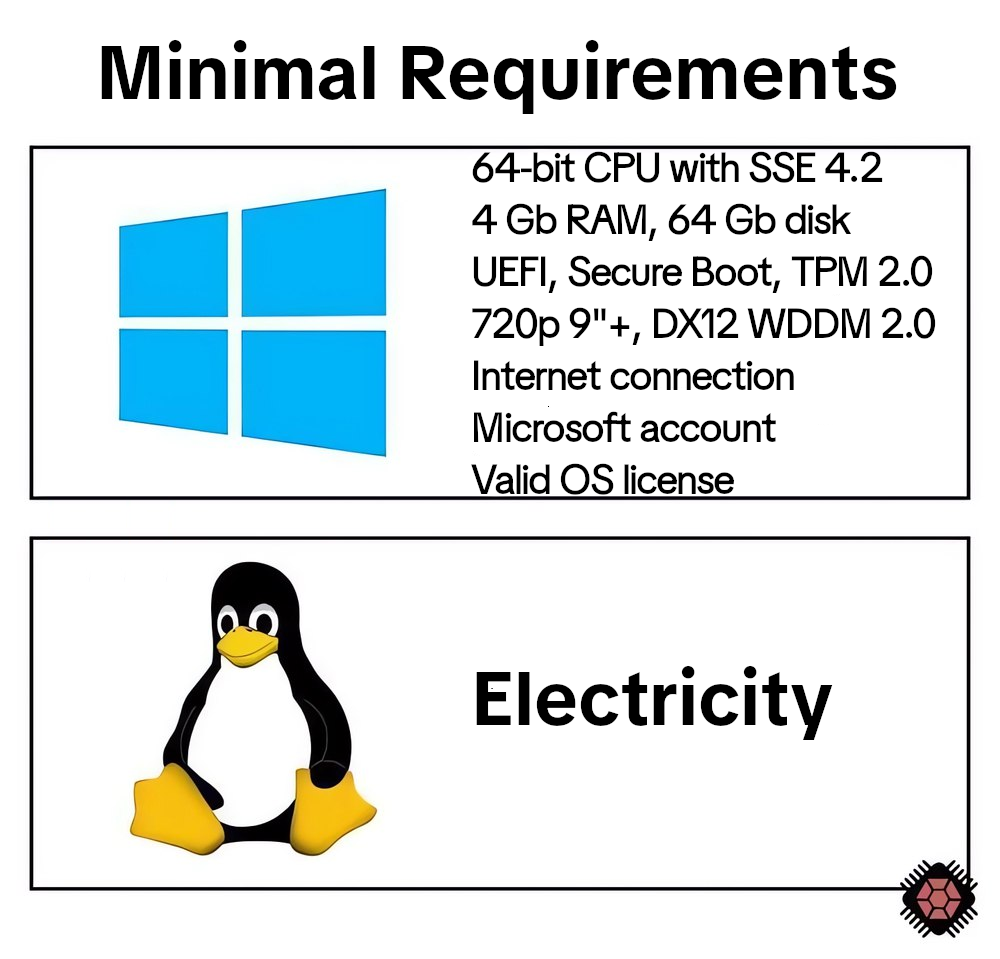

## Hallo meine lieben Kellerkinder,
Mein Name ist Christian, bin 19 Jahre alt und Sachse. 

Mein Boss sagte mir, ich soll einen GitHub-Account erstellen,
so bin ich jetzt hier. 🤪󠁤󠁥󠁳󠁮 (Wobei ich eigentlich schon viel länger hier am Start bin)
 
Ich interessiere mich für Züge 🚅 und Computer 🖥️ und fahre gerne Fahrrad 🚲
Gerade im Bereich Eisenbahn / Reisen würde ich gerne eigene Programme schreiben wollen, die das Reisen erleichtern.
Aber das ist aktuell noch ✨ Zukunftsmusik ✨

## Meine Ziel
**Ein erfolgreicher Abschluss meiner aktuellen Ausbildung und**
**hoffentlich viele spannende Projekte**
Mal schauen was wird....  
  

     
was wird...

Im übrigen finde ich, dass Linux die Zukunft im Gaming, und Windows 11 absoluter Bloatware-Schrott ist. Dennoch benutze ich es 🥸, da ich beim Versuch,
Geometry Dash & Zusi 3 auf einem Fedora-basierten Betriebssystem zum Laufen zu bringen, Crash-Out gegangen bin 🫤

<!--
**Amugosch/Amugosch** is a ✨ _special_ ✨ repository because its `README.md` (this file) appears on your GitHub profile.

Here are some ideas to get you started:

- 🔭 I’m currently working on ...
- 🌱 I’m currently learning ...
- 👯 I’m looking to collaborate on ...
- 🤔 I’m looking for help with ...
- 💬 Ask me about ...
- 📫 How to reach me: ...
- 😄 Pronouns: ...
- ⚡ Fun fact: ...
-->
